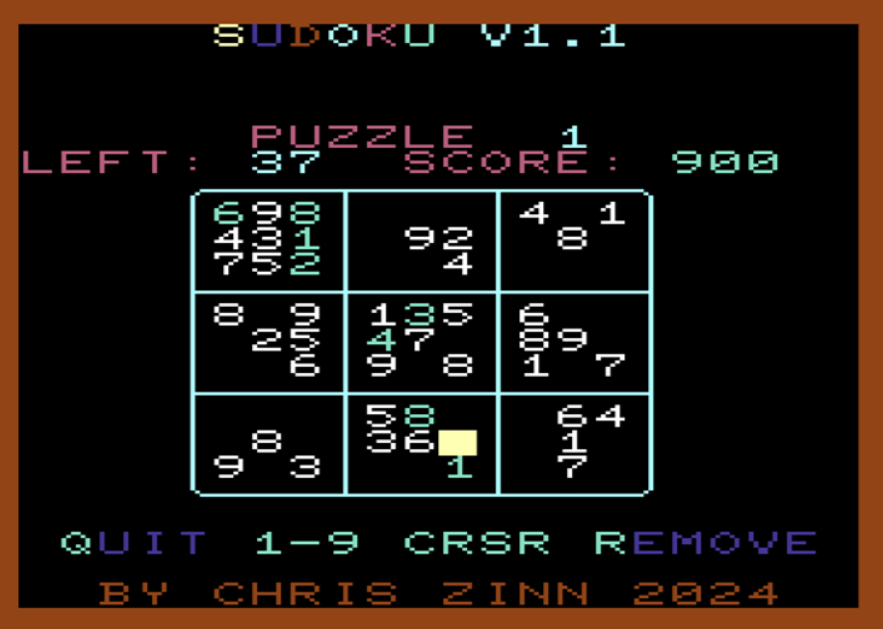

# sudoko_vic20

Sudoku in BASIC for the unexpanded VIC-20.

Features:
* 11 puzzles (4 Easy, 4 Medium, 2 Hard and 1 Diabolical)
* Sound Effects
* Run on the VIC with any memory expansions
* Utility included to easily replace or add your own puzzels
* Written with [CBM .prg Studio 4.4.0](https://www.ajordison.co.uk/)

